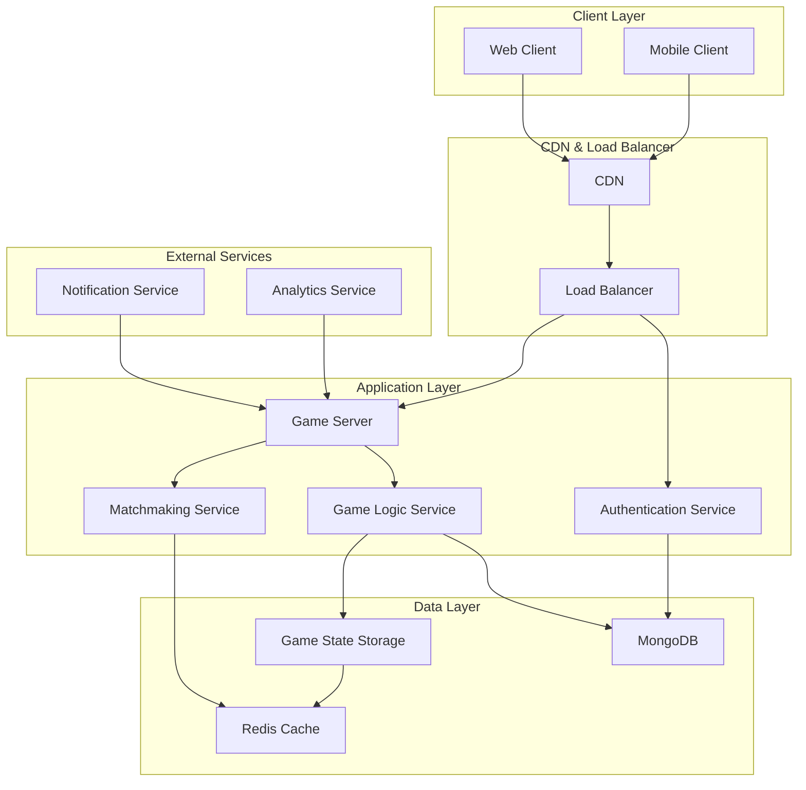

# 四人麻将游戏系统架构设计文档

## 1. 架构概述

### 1.1 项目背景
本项目是一个四人麻将游戏的核心系统，旨在实现一个可运行的麻将游戏原型，验证核心游戏流程的可行性。系统需要支持完整的牌局设置、游戏循环、响应处理和胜负判定机制。

### 1.2 架构目标
- 实现稳定可靠的游戏逻辑处理
- 支持实时多人游戏体验
- 确保游戏规则的准确执行
- 提供可扩展的系统设计以支持未来功能扩展

### 1.3 设计原则
- **模块化设计**: 将系统划分为独立的功能模块，便于维护和扩展
- **实时性**: 采用WebSocket实现实时通信，确保流畅的游戏体验
- **可扩展性**: 设计灵活的架构以支持不同麻将规则变种
- **安全性**: 实施多层次安全措施，防止作弊和数据泄露
- **性能优先**: 优化关键路径，确保低延迟的游戏体验

## 2. 系统架构

### 2.1 整体架构图


### 2.2 架构说明
系统采用前后端分离的微服务架构，前端负责用户界面展示和用户交互，后端由多个微服务组成，分别处理认证、匹配、游戏逻辑等不同职责。

## 3. 技术栈选择

### 3.1 前端技术栈
- **框架**: React 18+ 或 Vue 3+ (基于PRD中的建议)
- **状态管理**: Redux Toolkit 或 Vuex
- **UI组件库**: Ant Design 或 Element Plus (结合中国风设计)
- **实时通信**: Spring WebSocket-client
- **构建工具**: Vite
- **样式**: Tailwind CSS 或 Styled-components

### 3.2 后端技术栈
- **主语言**: Java 17+ (基于性能和企业级应用需求)
- **Web框架**: Spring Boot 3.x
- **实时通信**: Spring WebSocket
- **数据库**: PostgreSQL (关系型存储) + Redis (缓存和会话)
- **消息队列**: RabbitMQ 或 Apache Kafka
- **容器化**: Docker
- **部署**: Kubernetes 或 Docker Compose

### 3.3 基础设施
- **负载均衡**: Nginx 或 HAProxy
- **CDN**: Cloudflare 或 AWS CloudFront
- **监控**: Prometheus + Grafana
- **日志**: ELK Stack (Elasticsearch, Logstash, Kibana)

## 4. 核心服务设计

### 4.1 游戏服务器 (Game Server)
- **职责**: 处理所有游戏相关的实时通信
- **技术**: Spring WebSocket + Spring Boot
- **功能**:
  - 管理游戏房间和玩家连接
  - 广播游戏状态更新
  - 处理玩家操作请求
  - 实现游戏规则验证

### 4.2 认证服务 (Authentication Service)
- **职责**: 处理用户认证和授权
- **技术**: Spring Security + JWT
- **功能**:
  - 用户注册和登录
  - Token生成和验证
  - 权限管理

### 4.3 匹配服务 (Matchmaking Service)
- **职责**: 管理玩家匹配和房间创建
- **技术**: Spring Boot + Redis
- **功能**:
  - 玩家排队和匹配
  - 房间创建和管理
  - 玩家状态跟踪

### 4.4 游戏逻辑服务 (Game Logic Service)
- **职责**: 实现麻将游戏的核心逻辑
- **技术**: Spring Boot + Java
- **功能**:
  - 洗牌和发牌算法
  - 游戏状态管理
  - 胡牌判断算法
  - 响应处理（吃、碰、杠、胡）

## 5. 数据模型设计

### 5.1 玩家实体 (Player)
```typescript
interface Player {
  playerId: string;
  username: string;
  avatar: string;
  score: number;
  tokens: number;
  status: 'online' | 'offline' | 'in-game';
  createdAt: Date;
  updatedAt: Date;
}
```

### 5.2 游戏房间实体 (GameRoom)
```typescript
interface GameRoom {
  roomId: string;
  roomName: string;
  players: Player[];
  maxPlayers: 4;
  gameStatus: 'waiting' | 'playing' | 'finished';
  gameRule: MahjongRule;
  createdAt: Date;
  startedAt?: Date;
  finishedAt?: Date;
}
```

### 5.3 麻将牌实体 (MahjongTile)
```typescript
interface MahjongTile {
  tileId: string;
  suit: 'wan' | 'tong' | 'tiao' | 'zi';  // 万、筒、条、字
  value: number;  // 1-9 for numbered suits, 1-7 for zi (east, south, west, north, red dragon, green dragon, white dragon)
  isRedDragon?: boolean;  // 是否为红中
  isGreenDragon?: boolean;  // 是否为发财
  isWhiteDragon?: boolean;  // 是否为白板
}
```

### 5.4 游戏状态实体 (GameState)
```typescript
interface GameState {
  roomId: string;
  tiles: MahjongTile[];  // 牌墙
  playerHands: MahjongTile[][];  // 四位玩家的手牌
  discardedTiles: MahjongTile[][];  // 每位玩家打出的牌
  currentTurn: number;  // 当前轮到的玩家索引 (0-3)
  wallRemaining: number;  // 牌墙剩余数量
  lastDiscarded: MahjongTile | null;  // 最后打出的牌
  possibleActions: Action[];  // 当前可执行的动作
  gamePhase: 'setup' | 'playing' | 'response' | 'end';
}
```

## 6. 实时通信设计

### 6.1 WebSocket事件设计
- **连接事件**:
  - `connect`: 客户端连接
  - `disconnect`: 客户端断开连接
  - `reconnect`: 客户端重连

- **游戏事件**:
  - `join-room`: 加入游戏房间
  - `leave-room`: 离开游戏房间
  - `start-game`: 开始游戏
  - `draw-tile`: 摸牌
  - `discard-tile`: 打牌
  - `perform-action`: 执行操作（吃、碰、杠、胡）
  - `game-state-update`: 游戏状态更新
  - `game-over`: 游戏结束

### 6.2 通信协议
采用JSON格式传输数据，确保跨平台兼容性：
```json
{
  "event": "game-state-update",
  "payload": {
    "roomId": "room-123",
    "state": { /* game state */ },
    "timestamp": "2026-01-13T10:00:00Z"
  }
}
```

## 7. 安全性设计

### 7.1 认证与授权
- 使用JWT进行用户身份验证
- 实施角色权限控制
- 对敏感操作进行二次验证

### 7.2 防作弊机制
- 服务器端验证所有游戏操作
- 实施速率限制防止恶意请求
- 记录游戏日志用于审计

### 7.3 数据保护
- 对敏感数据进行加密存储
- 实施HTTPS/TLS加密传输
- 定期备份数据

## 8. 性能优化策略

### 8.1 前端优化
- 实施代码分割和懒加载
- 使用虚拟滚动处理大量数据
- 优化图片资源和缓存策略

### 8.2 后端优化
- 使用Redis缓存频繁访问的数据
- 实施数据库索引优化
- 采用连接池管理数据库连接

### 8.3 网络优化
- 使用CDN加速静态资源加载
- 实施WebSocket压缩减少传输数据量
- 优化游戏状态更新频率

## 9. 扩展性设计

### 9.1 微服务扩展
- 服务拆分遵循单一职责原则
- 使用API网关统一管理服务入口
- 实施服务发现和负载均衡

### 9.2 规则扩展
- 将麻将规则抽象为可配置模块
- 支持插件化扩展新规则
- 实施策略模式处理不同规则变种

## 10. 部署架构

### 10.1 容器化部署
- 使用Docker容器化所有服务
- 采用Docker Compose进行本地部署
- 使用Kubernetes进行生产环境编排

### 10.2 CI/CD流水线
- 使用GitHub Actions或Jenkins
- 自动化测试和部署流程
- 实施蓝绿部署减少停机时间

## 11. 监控与日志

### 11.1 系统监控
- 使用Prometheus收集指标
- Grafana进行可视化展示
- 设置告警阈值

### 11.2 日志管理
- 使用ELK Stack集中管理日志
- 结构化日志记录
- 实施日志分级

## 12. 未来演进方向

### 12.1 短期计划
- 完善基础游戏功能
- 优化用户体验
- 添加AI玩家支持

### 12.2 长期计划
- 支持更多麻将规则变种
- 实现跨平台游戏
- 扩展社交功能