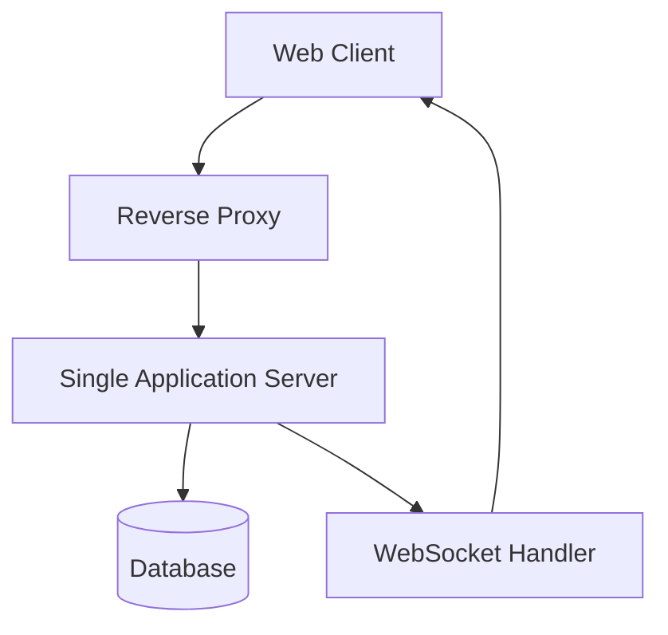

# 四人麻将游戏 MVP 架构设计文档

## 1. 架构概述

### 1.1 项目背景
本项目是一个四人麻将游戏的最小可行性产品（MVP），旨在快速验证核心游戏机制的可行性。系统专注于实现基础的麻将游戏功能，包括洗牌、发牌、摸牌、打牌和基础胡牌判断。

### 1.2 架构目标
- 快速实现可运行的四人麻将游戏原型
- 验证核心游戏流程的可行性
- 为后续功能扩展奠定基础

### 1.3 设计原则
- **快速交付**: 优先实现核心功能，快速上线验证
- **简洁性**: 保持架构简单，降低开发复杂度
- **可扩展性**: 为未来功能扩展预留接口
- **成本效益**: 控制初期开发和运维成本

## 2. 系统架构

### 2.1 整体架构图


### 2.2 架构说明
采用单体应用 + 前后端分离的架构模式，前端负责用户界面展示和交互，后端为单一应用服务器处理所有业务逻辑。

## 3. 技术栈选择

### 3.1 前端技术栈
- **框架**: React 18 + TypeScript
- **状态管理**: Redux Toolkit
- **UI组件库**: Ant Design
- **实时通信**: Socket.io-client
- **构建工具**: Vite
- **样式**: Tailwind CSS

### 3.2 后端技术栈
- **主语言**: Java 17+
- **Web框架**: Spring Boot 3.x
- **实时通信**: Spring WebSocket
- **数据库**: PostgreSQL
- **缓存**: JVM内存缓存（后续可升级为Redis）
- **部署**: Docker + Nginx

## 4. 核心模块设计

### 4.1 游戏房间模块
- **职责**: 管理游戏房间的创建和玩家加入
- **技术**: Spring Boot控制器 + JVM内存存储
- **功能**:
  - 创建游戏房间
  - 管理玩家加入/离开
  - 房间状态管理

### 4.2 游戏逻辑模块
- **职责**: 处理麻将游戏的核心逻辑
- **技术**: Spring Boot服务模块
- **功能**:
  - 洗牌和发牌算法
  - 游戏状态管理
  - 基础胡牌判断（平胡）
  - 玩家操作处理（摸牌、打牌）

### 4.3 用户模块
- **职责**: 基本用户认证和管理
- **技术**: Spring Security + JWT
- **功能**:
  - 用户注册和登录
  - 会话管理

### 4.4 实时通信模块
- **职责**: 处理玩家间的实时消息传递
- **技术**: Spring WebSocket
- **功能**:
  - 管理WebSocket连接
  - 广播游戏状态更新
  - 处理玩家操作请求

## 5. 数据模型设计

### 5.1 用户实体 (User)
```javascript
{
  userId: string,
  username: string,
  passwordHash: string,
  createdAt: Date,
  updatedAt: Date
}
```

### 5.2 游戏房间实体 (GameRoom)
```javascript
{
  roomId: string,
  roomName: string,
  players: [
    {
      playerId: string,
      username: string,
      position: number // 0-3, 东、南、西、北
    }
  ],
  gameStatus: 'waiting' | 'playing' | 'finished',
  createdAt: Date,
  startedAt: Date
}
```

### 5.3 游戏状态实体 (GameState)
```javascript
{
  roomId: string,
  tiles: Array<{suit: string, value: number}>, // 牌墙
  playerHands: Array<Array<{suit: string, value: number}>>, // 四位玩家的手牌
  discardedTiles: Array<Array<{suit: string, value: number}>>, // 每位玩家打出的牌
  currentTurn: number, // 当前轮到的玩家索引 (0-3)
  wallRemaining: number, // 牌墙剩余数量
  lastDiscarded: {suit: string, value: number} | null, // 最后打出的牌
  gamePhase: 'setup' | 'playing' | 'end'
}
```

## 6. 实时通信设计

### 6.1 WebSocket事件设计
- **连接事件**:
  - `connect`: 客户端连接
  - `disconnect`: 客户端断开连接

- **游戏事件**:
  - `join-room`: 加入游戏房间
  - `start-game`: 开始游戏
  - `draw-tile`: 摸牌
  - `discard-tile`: 打牌
  - `game-state-update`: 游戏状态更新
  - `game-over`: 游戏结束

### 6.2 通信协议
采用JSON格式传输数据：
```json
{
  "event": "game-state-update",
  "payload": {
    "roomId": "room-123",
    "state": { /* game state */ },
    "timestamp": "2026-01-13T10:00:00Z"
  }
}
```

## 7. 部署架构

### 7.1 服务器部署
- 单服务器部署
- Nginx作为反向代理和静态资源服务
- Docker容器化部署Spring Boot应用

### 7.2 部署流程
1. 代码提交到Git仓库
2. CI/CD自动构建和部署
3. PM2重启应用服务

## 8. 开发优先级

### 8.1 第一阶段（核心功能）
1. 实现基础游戏循环（摸牌、打牌）
2. 实现简单的胡牌判断（平胡）
3. 实现基本的实时通信
4. 创建游戏房间功能

### 8.2 第二阶段（基础完善）
1. 添加用户认证功能
2. 实现游戏状态持久化
3. 添加基础的UI界面
4. 实现游戏结果统计

### 8.3 第三阶段（功能增强）
1. 实现响应处理（吃、碰、杠）
2. 优化UI/UX设计
3. 添加音效和动画
4. 实现断线重连功能

## 9. 未来演进方向

当MVP验证成功后，可逐步演进为微服务架构：
- 将游戏逻辑服务独立出来
- 添加专门的匹配服务
- 实现更复杂的麻将规则
- 支持更多玩家同时在线