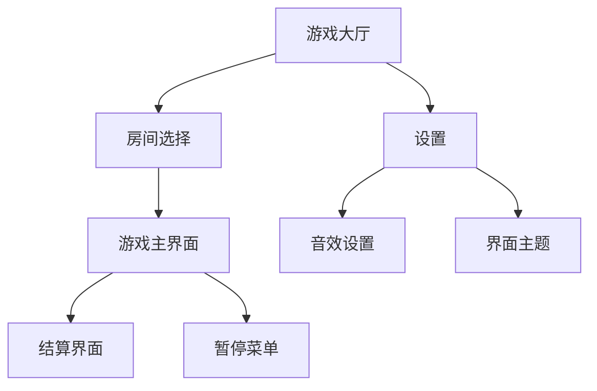
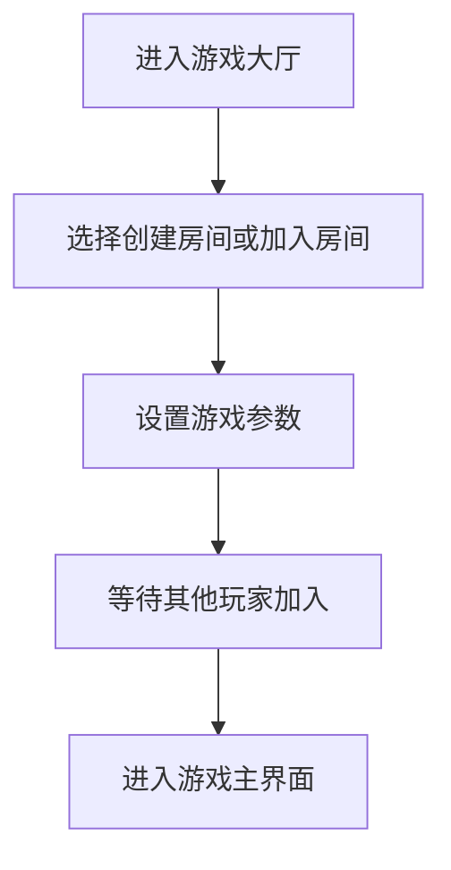
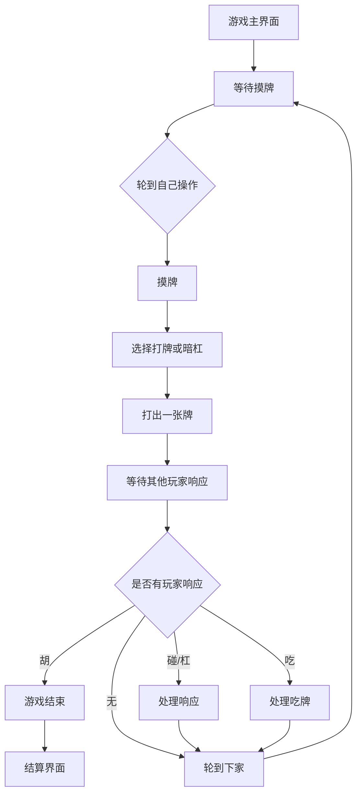

# 四人麻将游戏 UI/UX Specification

## 1. Introduction

This document defines the user experience goals, information architecture, user flows, and visual design specifications for 四人麻将游戏的核心系统's user interface. It serves as the foundation for visual design and frontend development, ensuring a cohesive and user-centered experience.

### 1.1 Overall UX Goals & Principles

#### Target User Personas
- **麻将爱好者:** 熟悉麻将规则的玩家，寻求顺畅的游戏体验和准确的规则执行
- **休闲玩家:** 偶尔玩麻将的用户，重视界面友好性和清晰的游戏指导
- **社交玩家:** 通过游戏与朋友互动的用户，关注多人游戏的便利性

#### Usability Goals
- 易学易用: 新用户能在几分钟内理解游戏界面和基本操作
- 高效操作: 熟练玩家可以快速进行摸牌、打牌和响应操作
- 错误预防: 对关键操作提供确认，防止误操作
- 记忆性: 间隔较长时间后再次使用无需重新学习

#### Design Principles
1. **清晰胜过巧妙** - 优先考虑清晰的沟通而非美学创新
2. **渐进式披露** - 只显示所需信息，适时呈现
3. **一致模式** - 在整个应用中使用熟悉的UI模式
4. **即时反馈** - 每个操作都应有清晰、即时的响应
5. **默认可访问** - 从一开始就为所有用户设计

### 1.2 Change Log

| Date | Version | Description | Author |
|------|---------|-------------|--------|
| 2026-01-13 | 1.0 | Initial creation of front-end spec | UX Expert |

## 2. Information Architecture (IA)

### 2.1 Site Map / Screen Inventory

### 2.2 Navigation Structure

**Primary Navigation:** 游戏大厅中的主要导航包括"开始游戏"、"设置"、"历史记录"等选项

**Secondary Navigation:** 游戏过程中通过悬浮菜单访问"设置"、"退出"等功能

**Breadcrumb Strategy:** 从游戏界面返回大厅时显示路径指示

## 3. User Flows

### 3.1 开始游戏流程

**User Goal:** 加入或创建游戏房间并开始麻将游戏

**Entry Points:** 游戏大厅页面

**Success Criteria:** 成功加入游戏并进入游戏主界面

**Edge Cases & Error Handling:**
- 房间已满时提示用户选择其他房间
- 网络连接失败时显示重连选项
- 玩家中途离开时处理方案

**Notes:** 需要考虑玩家匹配机制和房间容量限制

### 3.2 游戏进行流程

**User Goal:** 完成一轮麻将游戏

**Entry Points:** 游戏主界面

**Success Criteria:** 完成游戏并查看结算结果

**Edge Cases & Error Handling:**
- 玩家超时未操作的处理
- 网络延迟导致的操作冲突
- 游戏规则争议的处理

**Notes:** 需要清晰显示当前玩家状态和可执行操作

## 4. Wireframes & Mockups

### 4.1 设计文件链接
**Primary Design Files:** [待创建设计稿链接]

### 4.2 关键界面布局

#### 游戏大厅界面
**Purpose:** 为玩家提供游戏入口和设置选项

**Key Elements:**
- 快速开始按钮
- 房间列表
- 设置入口
- 玩家信息

**Interaction Notes:** 点击快速开始按钮可立即匹配游戏，点击房间可查看详情

**设计文件参考:** [待补充]

#### 游戏主界面
**Purpose:** 展示麻将游戏核心界面，包括玩家手牌、桌面牌、游戏状态

**Key Elements:**
- 玩家手牌区域
- 桌面出牌区
- 其他三家玩家信息
- 操作按钮（吃、碰、杠、胡等）
- 游戏状态提示

**Interaction Notes:** 点选手牌可选中，点击操作按钮执行相应动作

**设计文件参考:** [待补充]

#### 结算界面
**Purpose:** 显示游戏结束后的结果和得分统计

**Key Elements:**
- 获胜者标识
- 得分详情
- 胡牌牌型展示
- 返回大厅按钮

**Interaction Notes:** 点击返回大厅可重新开始游戏

**设计文件参考:** [待补充]

## 5. Component Library / Design System

### 5.1 设计系统方法
**Design System Approach:** 基于传统中国风元素创建麻将游戏专用设计系统

### 5.2 核心组件

#### 麻将牌组件
**Purpose:** 显示麻将牌的外观和状态

**Variants:** 万子、筒子、条子、字牌

**States:** 选中、不可操作、高亮

**Usage Guidelines:** 保持牌面清晰可辨，确保不同牌型易于区分

#### 操作按钮组件
**Purpose:** 提供游戏中的操作选项

**Variants:** 吃、碰、杠、胡、跳过

**States:** 可用、禁用、选中

**Usage Guidelines:** 按钮大小适中，确保触摸设备上的易用性

#### 玩家信息组件
**Purpose:** 显示玩家头像、昵称、分数等信息

**Variants:** 当前玩家、其他玩家

**States:** 在线、离线、思考中

**Usage Guidelines:** 信息展示清晰，状态变化及时更新

## 6. Branding & Style Guide

### 6.1 视觉身份
**Brand Guidelines:** 采用传统中国风元素，体现麻将文化特色

### 6.2 色彩方案
| Color Type | Hex Code | Usage |
|------------|----------|-------|
| Primary | #8B4513 | 主题色，代表传统木制麻将桌 |
| Secondary | #D2B48C | 辅助色，类似木质纹理 |
| Accent | #FF6B6B | 强调色，用于重要操作按钮 |
| Success | #51CF66 | 成功状态，如胡牌提示 |
| Warning | #FCC419 | 警告状态，如即将超时 |
| Error | #FF6B6B | 错误状态，如违规操作 |
| Neutral | #F8F9FA / #212529 | 文字、边框、背景等基础颜色 |

### 6.3 字体
#### 字体系列
- **Primary:** Microsoft YaHei, SimHei, sans-serif
- **Secondary:** STSong, serif
- **Monospace:** Consolas, Monaco, monospace

#### 字号规范
| Element | Size | Weight | Line Height |
|---------|------|--------|-------------|
| H1 | 24px | Bold | 1.4 |
| H2 | 20px | Bold | 1.4 |
| H3 | 18px | SemiBold | 1.4 |
| Body | 16px | Normal | 1.5 |
| Small | 14px | Normal | 1.4 |

### 6.4 图标
**Icon Library:** 使用定制麻将图标集

**Usage Guidelines:** 图标风格与整体设计保持一致，确保在不同尺寸下清晰可辨

### 6.5 间距与布局
**Grid System:** 采用12列网格系统

**Spacing Scale:** 4px, 8px, 12px, 16px, 24px, 32px, 48px

## 7. Accessibility Requirements

### 7.1 合规目标
**Standard:** WCAG 2.1 AA

### 7.2 关键要求
**Visual:**
- Color contrast ratios: 至少4.5:1 (AA级)
- Focus indicators: 所有可交互元素需有明显焦点指示器
- Text sizing: 支持文本放大至200%而不损失功能

**Interaction:**
- Keyboard navigation: 所有功能可通过键盘访问
- Screen reader support: 为所有界面元素提供适当的标签
- Touch targets: 触摸目标至少44x44像素

**Content:**
- Alternative text: 所有图像需提供替代文本
- Heading structure: 使用适当的标题层级结构
- Form labels: 所有表单控件需有关联标签

### 7.3 测试策略
定期使用自动化工具和手动测试验证可访问性

## 8. Responsiveness Strategy

### 8.1 断点
| Breakpoint | Min Width | Max Width | Target Devices |
|------------|-----------|-----------|----------------|
| Mobile | - | 768px | 智能手机 |
| Tablet | 768px | 1024px | 平板电脑 |
| Desktop | 1024px | - | 桌面设备 |

### 8.2 适配模式
**Layout Changes:** 移动设备上采用垂直布局，桌面设备上采用更宽的水平布局

**Navigation Changes:** 移动设备上使用汉堡菜单，桌面设备上显示完整导航

**Content Priority:** 优先显示核心游戏内容，次要信息可折叠

**Interaction Changes:** 触摸设备优化手势操作，鼠标设备优化点击操作

## 9. Animation & Micro-interactions

### 9.1 动画原则
**Motion Principles:** 动画应增强用户体验而非干扰，保持流畅自然的过渡效果

### 9.2 关键动画
- **牌移动动画:** 摸牌、打牌时的平滑移动效果 (Duration: 0.3s, Easing: ease-out)
- **响应提示动画:** 吃、碰、杠、胡操作的视觉反馈 (Duration: 0.2s, Easing: ease-in-out)
- **状态变化动画:** 玩家状态切换时的微妙过渡 (Duration: 0.15s, Easing: linear)

## 10. Performance Considerations

### 10.1 性能目标
- **Page Load:** 页面加载时间不超过3秒
- **Interaction Response:** 用户操作响应时间低于100毫秒
- **Animation FPS:** 动画保持60FPS流畅运行

### 10.2 设计策略
- 优化图像资源大小和格式
- 使用CSS硬件加速提升动画性能
- 预加载关键资源以减少等待时间

## 11. Next Steps

### 11.1 Immediate Actions
1. 与利益相关者审查此规范
2. 在设计工具中创建视觉设计
3. 为前端架构师准备交接材料
4. 确认技术可行性

### 11.2 设计交接清单
- [x] 所有用户流程已记录
- [x] 组件库已定义
- [x] 无障碍要求已定义
- [x] 响应式策略已明确
- [x] 品牌指南已整合
- [x] 性能目标已确立

## 12. Checklist Results

待执行UI/UX检查清单并在此处报告结果。